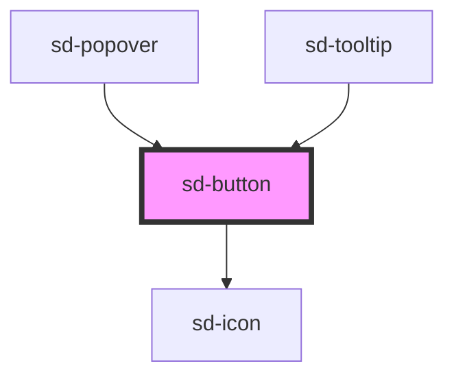

# sd-button

<!-- Auto Generated Below -->

## Properties

| Property    | Attribute    | Description | Type                                                                                                                                                                                   | Default     |
| ----------- | ------------ | ----------- | -------------------------------------------------------------------------------------------------------------------------------------------------------------------------------------- | ----------- |
| `color`     | `color`      |             | `string`                                                                                                                                                                               | `'#025497'` |
| `disabled`  | `disabled`   |             | `boolean`                                                                                                                                                                              | `false`     |
| `icon`      | `icon`       |             | `"arrowDown" \| "arrowLeft" \| "arrowLeftEnd" \| "arrowRight" \| "arrowRightEnd" \| "arrowUp" \| "check" \| "close" \| "date" \| "helpOutline" \| "pageMove" \| "search" \| undefined` | `undefined` |
| `iconRight` | `icon-right` |             | `"arrowDown" \| "arrowLeft" \| "arrowLeftEnd" \| "arrowRight" \| "arrowRightEnd" \| "arrowUp" \| "check" \| "close" \| "date" \| "helpOutline" \| "pageMove" \| "search" \| undefined` | `undefined` |
| `label`     | `label`      |             | `string`                                                                                                                                                                               | `''`        |
| `noHover`   | `no-hover`   |             | `boolean`                                                                                                                                                                              | `false`     |
| `size`      | `size`       |             | `"lg" \| "md" \| "sm" \| "xs"`                                                                                                                                                         | `'sm'`      |
| `type`      | `type`       |             | `"button" \| "reset" \| "submit"`                                                                                                                                                      | `'button'`  |
| `variant`   | `variant`    |             | `"ghost" \| "outline" \| "primary" \| undefined`                                                                                                                                       | `'primary'` |

## Events

| Event     | Description | Type                      |
| --------- | ----------- | ------------------------- |
| `sdClick` |             | `CustomEvent<MouseEvent>` |

## Dependencies

### Used by

 - [sd-popover](../sd-popover)
 - [sd-tooltip](../sd-tooltip)

### Depends on

- [sd-icon](../sd-icon)

### Graph

----------------------------------------------

*Built with [StencilJS](https://stenciljs.com/)*
