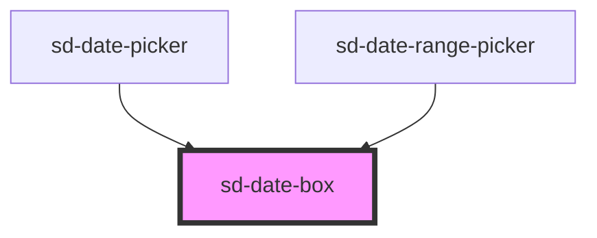

# sd-date-box

<!-- Auto Generated Below -->

## Properties

| Property      | Attribute       | Description | Type                       | Default |
| ------------- | --------------- | ----------- | -------------------------- | ------- |
| `date`        | `date`          |             | `null \| number \| string` | `null`  |
| `disabled`    | `disabled`      |             | `boolean`                  | `false` |
| `inRange`     | `in-range`      |             | `boolean`                  | `false` |
| `isEndDate`   | `is-end-date`   |             | `boolean`                  | `false` |
| `isStartDate` | `is-start-date` |             | `boolean`                  | `false` |
| `isToday`     | `is-today`      |             | `boolean`                  | `false` |
| `selected`    | `selected`      |             | `boolean`                  | `false` |
| `type`        | `type`          |             | `"" \| "end" \| "start"`   | `''`    |

## Events

| Event         | Description | Type                                    |
| ------------- | ----------- | --------------------------------------- |
| `sdClick`     |             | `CustomEvent<null \| number \| string>` |
| `sdMouseOver` |             | `CustomEvent<null \| number \| string>` |

## Dependencies

### Used by

 - [sd-date-picker](../sd-date-picker)
 - [sd-date-range-picker](../sd-date-range-picker)

### Graph

----------------------------------------------

*Built with [StencilJS](https://stenciljs.com/)*
