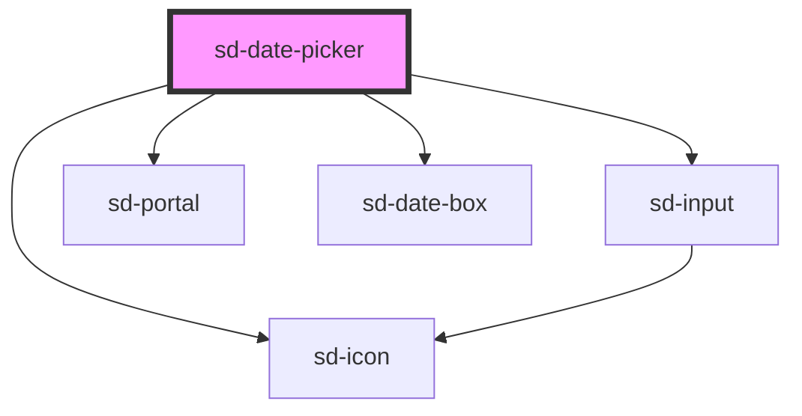

# sd-date-picker

<!-- Auto Generated Below -->

## Properties

| Property     | Attribute  | Description | Type                            | Default     |
| ------------ | ---------- | ----------- | ------------------------------- | ----------- |
| `date`       | `date`     |             | `null \| string`                | `null`      |
| `disabled`   | `disabled` |             | `boolean`                       | `false`     |
| `label`      | `label`    |             | `string \| undefined`           | `undefined` |
| `selectable` | --         |             | `[string, string] \| undefined` | `undefined` |

## Events

| Event      | Description | Type                          |
| ---------- | ----------- | ----------------------------- |
| `sdChange` |             | `CustomEvent<null \| string>` |

## Dependencies

### Depends on

- [sd-input](../sd-input)
- [sd-icon](../sd-icon)
- [sd-portal](../sd-portal)
- [sd-date-box](../sd-date-box)

### Graph

----------------------------------------------

*Built with [StencilJS](https://stenciljs.com/)*
