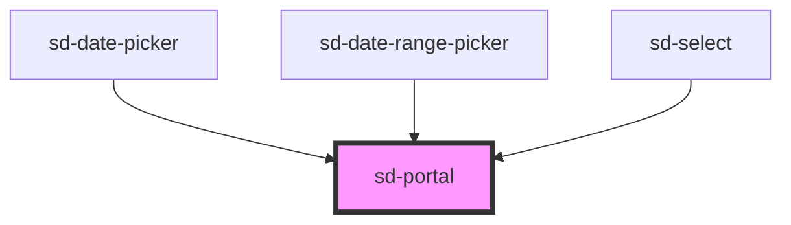

# sd-portal

<!-- Auto Generated Below -->

## Properties

| Property    | Attribute | Description | Type                    | Default  |
| ----------- | --------- | ----------- | ----------------------- | -------- |
| `offset`    | --        |             | `[number, number]`      | `[0, 4]` |
| `open`      | `open`    |             | `boolean`               | `false`  |
| `parentRef` | --        |             | `HTMLElement \| null`   | `null`   |
| `to`        | `to`      |             | `HTMLElement \| string` | `'body'` |
| `zIndex`    | `z-index` |             | `number`                | `9999`   |

## Events

| Event     | Description | Type                |
| --------- | ----------- | ------------------- |
| `sdClose` |             | `CustomEvent<void>` |

## Dependencies

### Used by

 - [sd-date-picker](../sd-date-picker)
 - [sd-date-range-picker](../sd-date-range-picker)
 - [sd-select](../sd-select)

### Graph

----------------------------------------------

*Built with [StencilJS](https://stenciljs.com/)*
