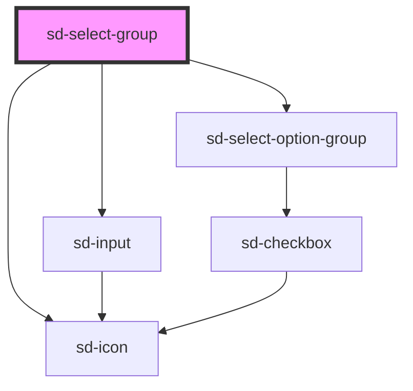

# sd-select-group

<!-- Auto Generated Below -->

## Properties

| Property            | Attribute            | Description | Type                                                                               | Default       |
| ------------------- | -------------------- | ----------- | ---------------------------------------------------------------------------------- | ------------- |
| `clearable`         | `clearable`          |             | `boolean`                                                                          | `false`       |
| `containerStyle`    | --                   |             | `undefined \| { [key: string]: string; }`                                          | `{}`          |
| `disabled`          | `disabled`           |             | `boolean`                                                                          | `false`       |
| `dropdownHeight`    | `dropdown-height`    |             | `string`                                                                           | `'260px'`     |
| `dropdownStyle`     | --                   |             | `undefined \| { [key: string]: string; }`                                          | `{}`          |
| `label`             | `label`              |             | `string`                                                                           | `''`          |
| `labelStyle`        | --                   |             | `undefined \| { [key: string]: string; }`                                          | `{}`          |
| `optionPlaceholder` | `option-placeholder` |             | `string`                                                                           | `'옵션이 없습니다.'` |
| `optionRenderer`    | --                   |             | `((option: SelectOption, index: number, isSelected: boolean) => any) \| undefined` | `undefined`   |
| `optionStyle`       | --                   |             | `undefined \| { [key: string]: string; }`                                          | `{}`          |
| `options`           | --                   |             | `SelectOptionGroup[]`                                                              | `[]`          |
| `placeholder`       | `placeholder`        |             | `string`                                                                           | `'선택'`        |
| `searchable`        | `searchable`         |             | `boolean`                                                                          | `false`       |
| `triggerStyle`      | --                   |             | `undefined \| { [key: string]: string; }`                                          | `{}`          |
| `value`             | `value`              |             | `null \| number \| string`                                                         | `null`        |
| `width`             | `width`              |             | `string`                                                                           | `'200px'`     |

## Events

| Event          | Description | Type                                                                              |
| -------------- | ----------- | --------------------------------------------------------------------------------- |
| `dropDownShow` |             | `CustomEvent<{ isOpen: boolean; }>`                                               |
| `sdChange`     |             | `CustomEvent<{ value: string \| number \| null; option: SelectOption \| null; }>` |

## Dependencies

### Depends on

- [sd-icon](../sd-icon)
- [sd-input](../sd-input)
- [sd-select-option-group](sd-select-item-group)

### Graph

----------------------------------------------

*Built with [StencilJS](https://stenciljs.com/)*
