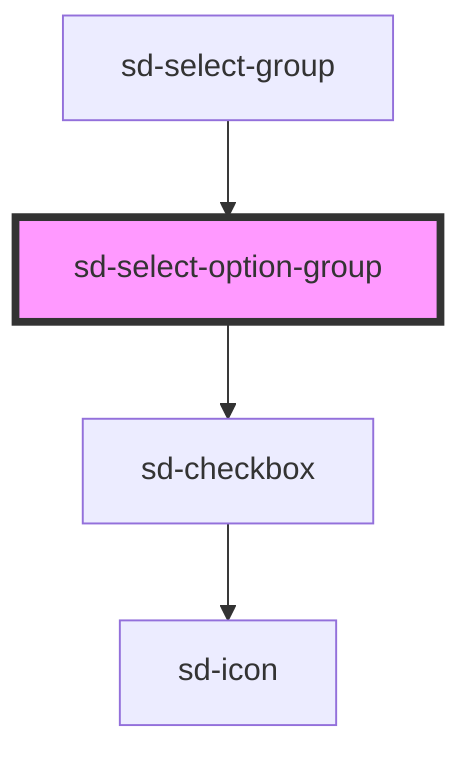

# sd-select-option-group

<!-- Auto Generated Below -->

## Properties

| Property              | Attribute      | Description | Type                                      | Default     |
| --------------------- | -------------- | ----------- | ----------------------------------------- | ----------- |
| `disabled`            | `disabled`     |             | `boolean`                                 | `false`     |
| `index` _(required)_  | `index`        |             | `number`                                  | `undefined` |
| `isFocused`           | `is-focused`   |             | `boolean`                                 | `false`     |
| `isSelected`          | `is-selected`  |             | `boolean`                                 | `false`     |
| `option` _(required)_ | --             |             | `SelectOptionGroup`                       | `undefined` |
| `optionStyle`         | --             |             | `undefined \| { [key: string]: string; }` | `undefined` |
| `useCheckbox`         | `use-checkbox` |             | `boolean`                                 | `false`     |

## Events

| Event         | Description | Type                                                                            |
| ------------- | ----------- | ------------------------------------------------------------------------------- |
| `optionClick` |             | `CustomEvent<{ option: SelectOptionGroup; index: number; event: MouseEvent; }>` |

## Methods

### `isDisabled() => Promise<boolean>`

#### Returns

Type: `Promise<boolean>`

## Dependencies

### Used by

 - [sd-select-group](..)

### Depends on

- [sd-checkbox](../../sd-checkbox)

### Graph

----------------------------------------------

*Built with [StencilJS](https://stenciljs.com/)*
