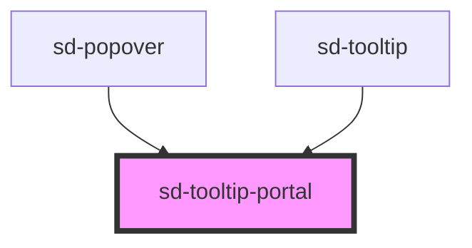

# sd-tooltip-portal

<!-- Auto Generated Below -->

## Properties

| Property    | Attribute   | Description | Type                                     | Default    |
| ----------- | ----------- | ----------- | ---------------------------------------- | ---------- |
| `offset`    | --          |             | `[number, number]`                       | `[0, 0]`   |
| `open`      | `open`      |             | `boolean`                                | `false`    |
| `parentRef` | --          |             | `HTMLElement \| null`                    | `null`     |
| `placement` | `placement` |             | `"bottom" \| "left" \| "right" \| "top"` | `'bottom'` |
| `to`        | `to`        |             | `HTMLElement \| string`                  | `'body'`   |
| `zIndex`    | `z-index`   |             | `number`                                 | `9999`     |

## Events

| Event     | Description | Type                |
| --------- | ----------- | ------------------- |
| `sdClose` |             | `CustomEvent<void>` |

## Dependencies

### Used by

 - [sd-popover](../sd-popover)
 - [sd-tooltip](../sd-tooltip)

### Graph

----------------------------------------------

*Built with [StencilJS](https://stenciljs.com/)*
