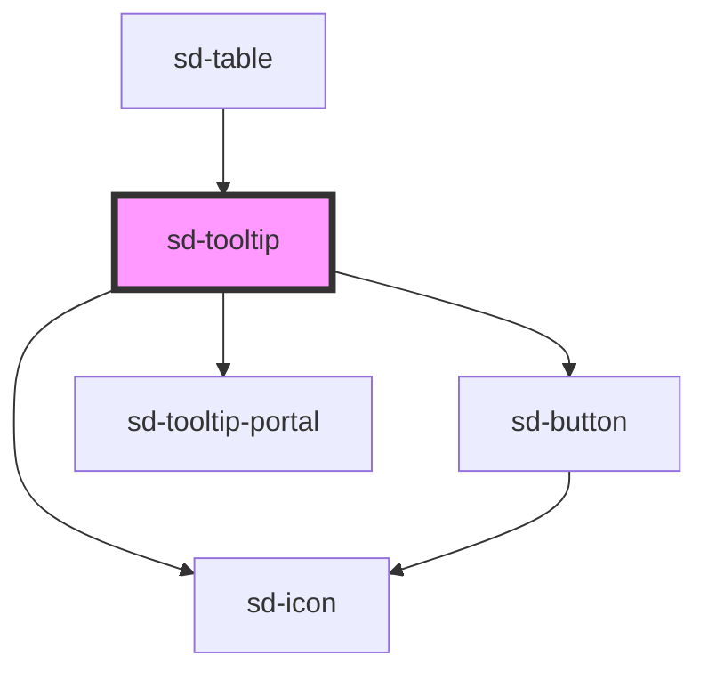

# sd-tooltip

<!-- Auto Generated Below -->

## Properties

| Property        | Attribute        | Description | Type                                                                                                                                                                      | Default         |
| --------------- | ---------------- | ----------- | ------------------------------------------------------------------------------------------------------------------------------------------------------------------------- | --------------- |
| `buttonSize`    | `button-size`    |             | `"lg" \| "md" \| "sm" \| "xs"`                                                                                                                                            | `'sm'`          |
| `buttonVariant` | `button-variant` |             | `"ghost" \| "outline" \| "primary"`                                                                                                                                       | `'primary'`     |
| `color`         | `color`          |             | `string`                                                                                                                                                                  | `'#01BB4B'`     |
| `icon`          | `icon`           |             | `"arrowDown" \| "arrowLeft" \| "arrowLeftEnd" \| "arrowRight" \| "arrowRightEnd" \| "arrowUp" \| "check" \| "close" \| "date" \| "helpOutline" \| "pageMove" \| "search"` | `'helpOutline'` |
| `iconSize`      | `icon-size`      |             | `number`                                                                                                                                                                  | `12`            |
| `label`         | `label`          |             | `string`                                                                                                                                                                  | `''`            |
| `noHover`       | `no-hover`       |             | `boolean`                                                                                                                                                                 | `true`          |
| `placement`     | `placement`      |             | `"bottom" \| "left" \| "right" \| "top"`                                                                                                                                  | `'top'`         |
| `trigger`       | `trigger`        |             | `"click" \| "hover"`                                                                                                                                                      | `'hover'`       |
| `useClose`      | `use-close`      |             | `boolean`                                                                                                                                                                 | `false`         |

## Dependencies

### Used by

 - [sd-table](../sd-table)

### Depends on

- [sd-button](../sd-button)
- [sd-icon](../sd-icon)
- [sd-tooltip-portal](../sd-tooltip-portal)

### Graph

----------------------------------------------

*Built with [StencilJS](https://stenciljs.com/)*
